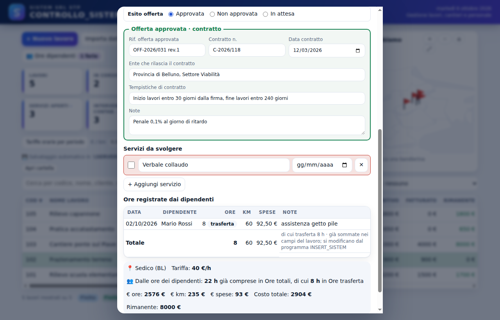

# Guida per l'amministrazione

SISTEM SRL STP · CONTROLLO_SISTEM e INSERT_SISTEM · versione 1.9

<div class="lead">

Questa guida porta passo passo dall'installazione all'uso quotidiano: **cartelle e permessi sul server**, installazione di **CONTROLLO_SISTEM** sul PC dell'amministratore (Windows 7, 32 bit), creazione dei dipendenti e gestione di ore, ferie e report. Per i PC dei dipendenti c'è la *Guida per i dipendenti*.

</div>

**Indice**

1. Come funziona: programmi e cartelle
2. Cosa scaricare
3. Server: creare le cartelle
4. Server: condivisione e permessi
5. Server: controllo da un PC e backup
6. PC dell'amministratore: installare CONTROLLO_SISTEM
7. Primo avvio: dati, PIN e collegamento al server
8. Creare i dipendenti e installare INSERT_SISTEM sui loro PC
9. Uso quotidiano
10. Aggiornamenti, backup e recupero
11. Problemi frequenti

<div class="pb"></div>

## 1. Come funziona: programmi e cartelle

| Programma | Dove si installa | A cosa serve |
| --- | --- | --- |
| **CONTROLLO_SISTEM** | solo sul PC dell'amministratore | lavori, offerte e contratti, costi, cantieri, dipendenti e PIN, ferie, report per le buste paga |
| **INSERT_SISTEM** | sui PC dei dipendenti | ore (ufficio, cantiere, trasferta), km, spese, ferie e permessi |

I due programmi non si parlano direttamente: si scambiano i dati attraverso **una cartella condivisa sul server**. I dati riservati dell'amministrazione stanno in **un'altra cartella del server**, che i dipendenti non vedono.

```
SERVER
├── ControlloLavori\              condivisa: amministratore + dipendenti
│   ├── dipendenti.json           nomi, permessi e PIN cifrati      (scrive CONTROLLO_SISTEM)
│   ├── codici.json               elenco lavori: codice, nome, cliente  (scrive CONTROLLO_SISTEM)
│   ├── ferie.json                esiti delle richieste, ferie assegnate (scrive CONTROLLO_SISTEM)
│   └── ore\                      un file per dipendente              (scrive INSERT_SISTEM)
│       ├── d…json
│       └── …
├── Amministrazione\ControlloLavori\   privata: solo amministratore
│   ├── dati_lavori.json          tutti i dati dei lavori (importi, contratti…)
│   └── storico\                  una copia al giorno, ultimi 60 giorni
└── Programmi\                    gli installatori, in sola lettura
```

**Regole d'oro**

- I file nelle cartelle li scrivono i programmi: **non aprirli, non spostarli e non cancellarli a mano**.
- Ogni file ha un solo "scrittore": per questo due persone non si sovrascrivono mai.
- Se il server non risponde, i dipendenti lavorano lo stesso: le ore restano sul loro PC e partono appena il server torna.

## 2. Cosa scaricare

Pagina di download: **https://github.com/sistembelluno-lang/Newsistem/releases/latest**, voce *Assets* (se richiesto, accedi con l'account *sistembelluno-lang*).

| File | Per chi |
| --- | --- |
| `CONTROLLO_SISTEM-1.9.0-Windows7-32bit-setup.exe` | PC dell'amministratore |
| `INSERT_SISTEM-1.9.0-Windows7-32bit-setup.exe` | PC dei dipendenti (va copiato in `Programmi` sul server) |
| `Guida_Amministratore.pdf` | questa guida |
| `Guida_Dipendenti.pdf` | da stampare per i dipendenti |

I file *Windows7-32bit* funzionano su Windows 7, 8, 10 e 11: usa questi su tutti i PC.

<div class="pb"></div>

## 3. Server: creare le cartelle

*Da fare sul server con un utente amministratore di Windows (o dal tecnico). Circa 10 minuti.*

Negli esempi il disco dei dati del server è `D:` e il server si chiama `SERVER`: usa i nomi reali.

1. Sul server apri **Esplora risorse** e vai in `D:\` (o nel disco dove tenete i dati).
2. Crea la cartella **`ControlloLavori`** (tasto destro → *Nuovo* → *Cartella*). Scrivi il nome esattamente così, senza spazi.
3. Entra in `ControlloLavori` e crea la sottocartella **`ore`**.
4. Torna in `D:\` e crea la cartella **`Amministrazione`**; dentro crea **`ControlloLavori`**.
5. In `D:\` crea la cartella **`Programmi`**.
6. Copia in `D:\Programmi` il file `INSERT_SISTEM-1.9.0-Windows7-32bit-setup.exe` (e, se vuoi, `Guida_Dipendenti.pdf`).

Alla fine devi avere:

```
D:\ControlloLavori\
D:\ControlloLavori\ore\
D:\Amministrazione\ControlloLavori\
D:\Programmi\
```

*Se usate un NAS (Synology, QNAP…) invece di un server Windows: crea le stesse cartelle condivise dal pannello del NAS (ControlloLavori, Amministrazione, Programmi) e assegna gli stessi permessi del capitolo 4.*

**Utenti e gruppi** (consigliato): sul server, o nel dominio, crea un gruppo **`Dipendenti`** e mettici gli utenti Windows dei dipendenti. Se i PC dei dipendenti usano tutti lo stesso utente Windows, basta quell'utente.

<div class="pb"></div>

## 4. Server: condivisione e permessi

Windows ha due livelli di permessi: la **condivisione** (chi può raggiungere la cartella dalla rete) e la scheda **Sicurezza** (cosa può fare dentro). Conviene aprire la condivisione a tutti gli utenti e regolare tutto dalla scheda Sicurezza.

**4.1 Condividere `ControlloLavori`**

1. Tasto destro su `D:\ControlloLavori` → **Proprietà** → scheda **Condivisione** → **Condivisione avanzata…**
2. Spunta **Condividi la cartella**. Nome condivisione: **`ControlloLavori`**.
3. **Autorizzazioni** → seleziona *Everyone* (o *Utenti autenticati*) → spunta **Controllo completo** → **OK** → **OK**.
4. Il percorso di rete diventa **`\\SERVER\ControlloLavori`**.

**4.2 Permessi su `ControlloLavori` (scheda Sicurezza)**

1. Sempre in **Proprietà** → scheda **Sicurezza** → **Modifica…**
2. **Aggiungi…** → scrivi l'utente Windows dell'amministratore → **OK** → spunta **Controllo completo**.
3. **Aggiungi…** → scrivi **`Dipendenti`** (il gruppo) → **OK** → lascia solo **Lettura ed esecuzione**, **Visualizzazione contenuto cartella** e **Lettura**.
4. Se nell'elenco ci sono *Utenti* o *Everyone* con permessi di scrittura, toglili (pulsante **Avanzate** → **Disabilita ereditarietà** → *Converti* se Windows non lascia modificarli).
5. **OK**.

**4.3 Permessi sulla sottocartella `ore`**

1. Tasto destro su `D:\ControlloLavori\ore` → **Proprietà** → **Sicurezza** → **Modifica…**
2. Seleziona **`Dipendenti`** → spunta anche **Modifica** e **Scrittura** → **OK**.

In questo modo i dipendenti possono scrivere solo le proprie ore e non possono toccare l'elenco dei dipendenti, i PIN, l'elenco dei lavori e le ferie approvate.

**4.4 Condividere `Amministrazione` (privata)**

1. Tasto destro su `D:\Amministrazione` → **Proprietà** → **Condivisione** → **Condivisione avanzata…** → **Condividi la cartella**, nome **`Amministrazione`**.
2. **Autorizzazioni**: togli *Everyone*, aggiungi **solo l'utente dell'amministratore** con **Controllo completo**.
3. Scheda **Sicurezza**: amministratore **Controllo completo**; **nessun permesso** per `Dipendenti`, *Utenti* o *Everyone*.
4. Il percorso diventa **`\\SERVER\Amministrazione\ControlloLavori`**.

**4.5 Condividere `Programmi`**

Come `ControlloLavori`, ma con **sola lettura** per `Dipendenti` (Lettura ed esecuzione). Percorso: **`\\SERVER\Programmi`**.

**Riepilogo dei permessi**

| Cartella | Amministratore | Dipendenti |
| --- | --- | --- |
| `\\SERVER\ControlloLavori` | controllo completo | sola lettura |
| `\\SERVER\ControlloLavori\ore` | controllo completo | modifica |
| `\\SERVER\Amministrazione\ControlloLavori` | controllo completo | **nessun accesso** |
| `\\SERVER\Programmi` | controllo completo | sola lettura |

<div class="pb"></div>

## 5. Server: controllo da un PC e backup

**Verifica da un PC di un dipendente** (con il suo utente Windows):

1. Premi **Windows + R**, scrivi `\\SERVER\ControlloLavori` e premi **Invio**: la cartella si apre.
2. Prova a creare un file di testo in `ControlloLavori`: **non deve riuscire** (sola lettura).
3. Prova a creare un file di testo in `ControlloLavori\ore`: **deve riuscire**. Poi cancellalo.
4. Prova `\\SERVER\Amministrazione`: **deve dare accesso negato**.

**Verifica dal PC dell'amministratore**: le tre cartelle si aprono e si può scrivere in tutte.

Se il nome `SERVER` non funziona, usa l'indirizzo IP del server, per esempio `\\192.168.1.10\ControlloLavori`. Non serve collegare una lettera di unità (Z:, Y:…): i programmi usano direttamente il percorso `\\SERVER\…`, che non cambia da un PC all'altro.

**Backup**: includi nei backup del server `D:\ControlloLavori` e `D:\Amministrazione` (almeno una volta al giorno). In più CONTROLLO_SISTEM tiene da solo una copia al giorno in `Amministrazione\ControlloLavori\storico` (ultimi 60 giorni).

<div class="pb"></div>

## 6. PC dell'amministratore: installare CONTROLLO_SISTEM

*Windows 7, 32 bit. Circa 5 minuti.*

1. Scarica `CONTROLLO_SISTEM-1.9.0-Windows7-32bit-setup.exe` dalla pagina di download (capitolo 2).
2. Fai doppio clic sul file. Se compare un avviso di sicurezza scegli **Esegui** (su Windows 10/11: *Ulteriori informazioni* → *Esegui comunque*): il programma non ha una firma digitale a pagamento, è normale.
3. Lascia la cartella proposta, premi **Installa**, poi **Fine**. Sul desktop e nel menu Start compare l'icona **CONTROLLO_SISTEM** (una "S" blu-viola).
4. Se sul PC c'era la versione precedente (*Controllo Lavori*), dopo l'installazione disinstallala da **Pannello di controllo → Programmi e funzionalità**. I dati non si perdono.

**Cartelle sul PC dell'amministratore** (create dal programma, non vanno toccate):

| Cartella | Contenuto |
| --- | --- |
| `C:\Users\<utente>\AppData\Roaming\Controllo Lavori\` | impostazioni del programma e copia locale dei dati |
| `C:\Users\<utente>\Documents\Controllo Lavori\` | salvataggio automatico, solo finché non scegli la cartella del server (capitolo 7) |

<figure><figcaption>CONTROLLO_SISTEM: la schermata principale.</figcaption></figure>

<div class="pb"></div>

## 7. Primo avvio: dati, PIN e collegamento al server

1. **Caricare i dati esistenti**: **Importa dati** → **Scegli file .json…** → il tuo backup. Si fa solo la prima volta.
2. **Salvataggio sul server**: sotto le tariffe c'è la riga *Salvataggio automatico in …* → **Cambia cartella** → nella casella *Cartella* scrivi `\\SERVER\Amministrazione\ControlloLavori` → Invio → **Seleziona cartella**. Da qui in poi ogni modifica si salva lì da sola.
3. **PIN di apertura**: **👥 Ore dipendenti** → **Impostazioni** → **Imposta PIN di apertura** → un PIN di 4-8 cifre (diverso da quelli dei dipendenti), da ripetere. Il programma lo chiederà a ogni apertura e dopo 20 minuti senza attività; **🔒 Blocca** lo chiude subito.
4. **Cartella condivisa**: sempre in **Impostazioni** → **Scegli cartella…** → scrivi `\\SERVER\ControlloLavori` → Invio → **Seleziona cartella**.
5. Proteggi anche il tuo utente di Windows con una password.

<figure><figcaption>Impostazioni: cartella condivisa, lavori visibili ai dipendenti, PIN di apertura.</figcaption></figure>

<figure class="sm" style="max-width:420px;margin-left:auto;margin-right:auto"><figcaption>La schermata del PIN di apertura.</figcaption></figure>

<div class="pb"></div>

## 8. Creare i dipendenti e installare INSERT_SISTEM sui loro PC

**8.1 In CONTROLLO_SISTEM**

1. **👥 Ore dipendenti** → scheda **Dipendenti e PIN**.
2. **Imposta PIN amministratore**: con questo PIN entri nel programma dei dipendenti da qualsiasi PC.
3. Per ogni persona: **+ Aggiungi dipendente** → nome e cognome → **Imposta** → il suo PIN (4-8 cifre).
4. Colonna **Ore su lavori**: *Tutti i lavori* oppure *Solo cantieri (Worksite)*. Lascia spuntati **Ferie, permessi, malattia** e **Attivo**.
5. **Salva dipendenti**. L'elenco dei lavori viene pubblicato sul server in automatico.
6. Comunica a ciascuno il suo PIN di persona.

<figure><figcaption>Dipendenti e PIN.</figcaption></figure>

**8.2 Su ogni PC dei dipendenti** (5 minuti a PC, con il dipendente presente)

1. **Windows + R** → `\\SERVER\Programmi` → doppio clic su `INSERT_SISTEM-1.9.0-Windows7-32bit-setup.exe` → **Esegui** → **Installa** → **Fine**.
2. Al primo avvio INSERT_SISTEM chiede la cartella condivisa: **Scegli cartella…** → `\\SERVER\ControlloLavori` → **Seleziona cartella**. Una volta sola per PC.
3. Il dipendente sceglie il suo nome e scrive il PIN.
4. **Prova**: inserisce un'ora su un lavoro e salva. Su CONTROLLO_SISTEM, entro un minuto, le ore compaiono nella scheda del lavoro in *Ore totali*. Poi la cancella con ✕.
5. Lasciagli la *Guida per i dipendenti*.

**Non installare mai CONTROLLO_SISTEM sui PC dei dipendenti.**

<div class="pb"></div>

## 9. Uso quotidiano

**Le ore arrivano da sole**: CONTROLLO_SISTEM rilegge il server all'apertura, ogni minuto e quando ci torni sopra. Le ore si sommano a *Ore totali* (e a *Ore trasferta*), i km a *Km*, le spese ai campi del lavoro (pasti → *Pasti*, hotel → *Spese trasferta*, generiche e minuteria → *Extra*). Le uscite in cantiere compaiono tra gli interventi del Worksite.

**Offerte e contratti**: nella scheda del lavoro, *Esito offerta* → **Approvata** apre la scheda del contratto (rif. offerta approvata, numero e data, ente, tempistiche, note).

<figure><figcaption>Offerta approvata e scheda del contratto.</figcaption></figure>

**👥 Ore dipendenti**, scheda per scheda:

| Scheda | Cosa trovi |
| --- | --- |
| Registrazioni | tutto ciò che i dipendenti hanno inserito: dove, km e auto, spese per tipologia |
| Report mensile | per dipendente o per tutti: **Stampa**, **Esporta PDF**, **Esporta Excel** per le buste paga |
| Ferie e permessi | richieste da approvare (✓ / ✕ con motivo), calendario del mese, **+ Assegna ferie o permesso** |
| Dipendenti e PIN | nuovi dipendenti, PIN, permessi, *Attivo* |
| Impostazioni | cartella condivisa, lavori visibili ai dipendenti, PIN di apertura |

<figure><figcaption>Ferie e permessi: richieste, calendario e ferie programmate.</figcaption></figure>

**Colori dei giorni**: <span class="sw g-fest"></span> rosso festivi · <span class="sw g-fp"></span> viola ferie programmate · <span class="sw g-att"></span> viola a righe richiesta in attesa · <span class="sw g-fe"></span> blu ferie fatte · <span class="sw g-ma"></span> giallo malattia.

<figure class="sm"><figcaption>Il report mensile stampato o in PDF, con km per auto e spese per tipologia.</figcaption></figure>

## 10. Aggiornamenti, backup e recupero

- **Nuova versione**: scarica i nuovi setup, installa CONTROLLO_SISTEM sul tuo PC, metti il nuovo INSERT_SISTEM in `\\SERVER\Programmi` e installalo sui PC dei dipendenti. Dati e impostazioni restano.
- **Backup manuale**: ogni tanto **Esporta backup** e conserva il file `.json` (anche su una chiavetta).
- **Tornare indietro di qualche giorno**: in `\\SERVER\Amministrazione\ControlloLavori\storico` c'è un file per giorno (`backup_lavori_AAAA-MM-GG.json`): **Importa dati** → scegli quel file.
- **PC dell'amministratore nuovo o rotto**: installa CONTROLLO_SISTEM, **Cambia cartella** → `\\SERVER\Amministrazione\ControlloLavori`: i lavori si ricaricano dal file del server. Poi **Impostazioni** → cartella condivisa e PIN di apertura.

## 11. Problemi frequenti

| Problema | Soluzione |
| --- | --- |
| "Cartella condivisa non raggiungibile" | Il server è spento o il PC non è in rete. Prova `\\SERVER\ControlloLavori` da Windows + R; se non si apre, chiama il tecnico |
| Un dipendente non riesce a salvare | Controlla i permessi di **modifica** sulla cartella `ore` (capitolo 4.3) |
| Un dipendente vede "PIN errato" | 👥 → Dipendenti e PIN → **Cambia** accanto al nome → Salva dipendenti |
| ⚠ sul pulsante 👥 | Ore su un lavoro cancellato o con codice cambiato: ripristina il codice o fai correggere la riga |
| Un lavoro non compare ai dipendenti | È *Finito* o *Non fare*: si può mostrare anche i Finiti da 👥 → Impostazioni |
| PIN di apertura dimenticato | Chiudi il programma, cancella `C:\Users\<utente>\AppData\Roaming\Controllo Lavori\Local Storage`, riapri: i lavori si ricaricano dal server; imposta un nuovo PIN |
| Avviso di Windows all'avvio | Normale: *Esegui* (Windows 10/11: *Ulteriori informazioni* → *Esegui comunque*) |

**Prima di partire con tutti**

- ☐ Cartelle e permessi verificati da un PC dei dipendenti (capitolo 5)
- ☐ Una settimana di prova con 1-2 dipendenti
- ☐ **Esporta backup** il primo giorno e conserva il file
- ☐ Cartelle del server incluse nei backup
