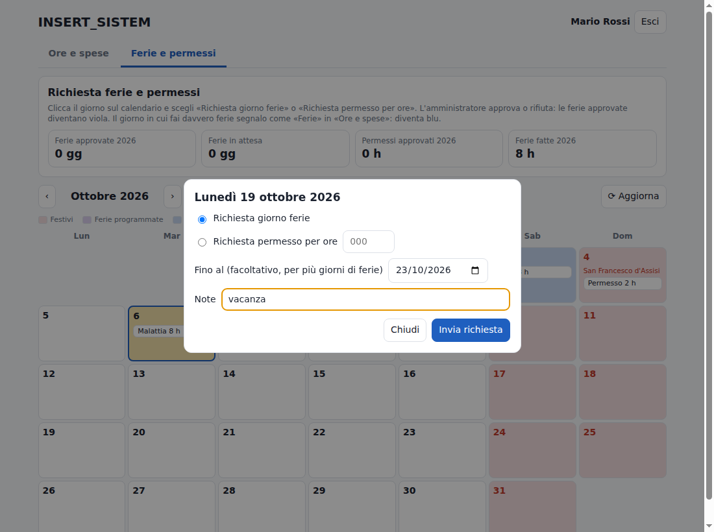
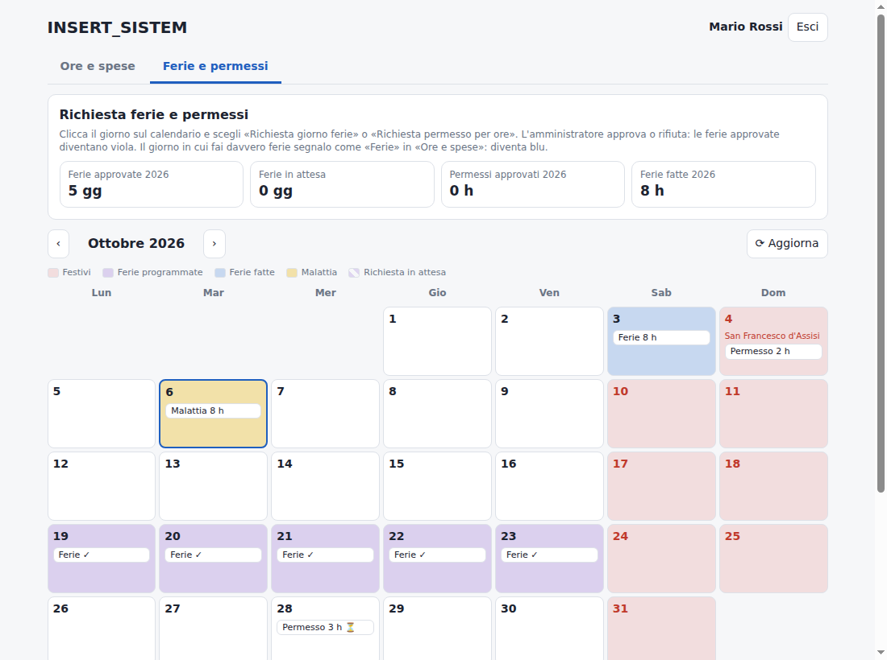
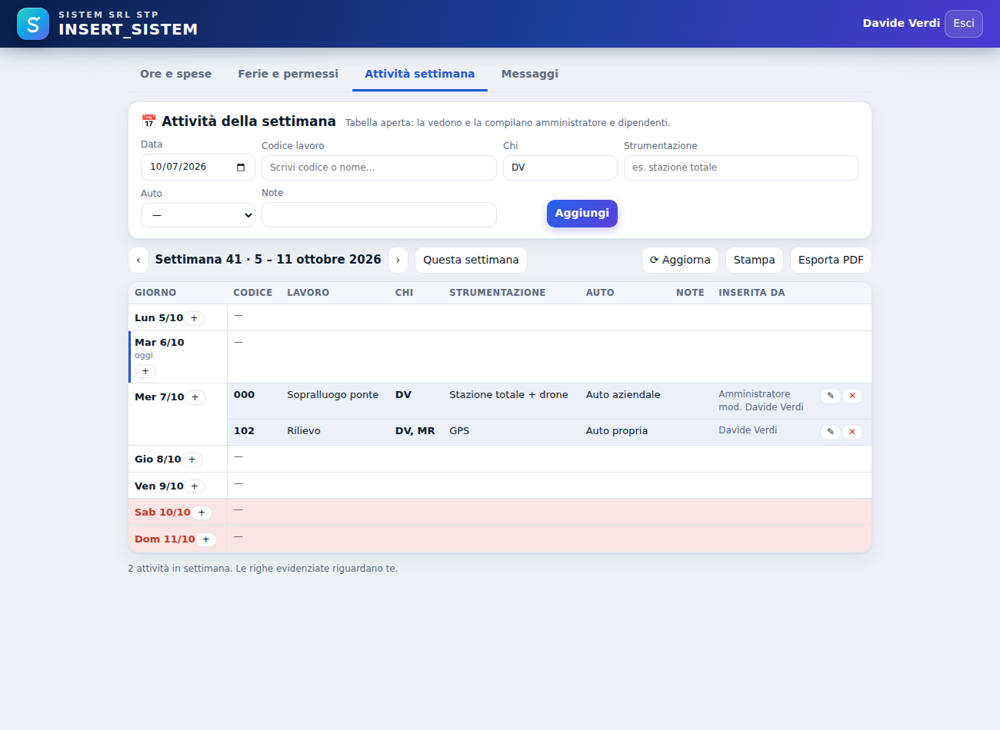
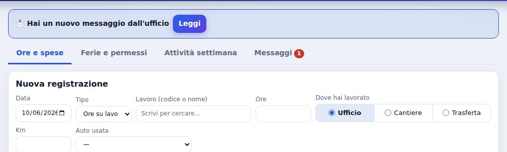
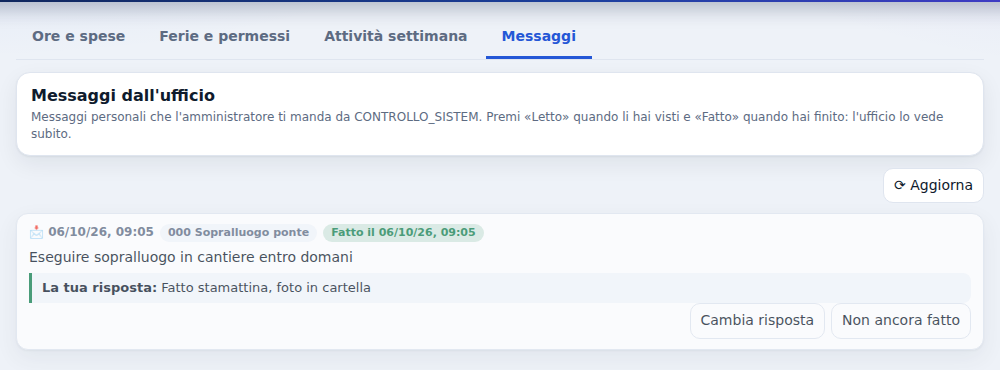

# Guida per i dipendenti

SISTEM SRL STP · INSERT_SISTEM · versione 1.10

Con **INSERT_SISTEM** registri le tue ore sui lavori (in ufficio, in cantiere o in trasferta), i km, le spese, le ferie e i permessi, consulti e compili la tabella delle **attività della settimana** e ricevi i **messaggi** dall'ufficio. Tutto arriva in ufficio da solo: non serve mandare fogli o email.

**Indice**

1. Installare il programma sul tuo PC
2. Il primo avvio: collegamento al server
3. Entrare con il tuo PIN
4. Inserire le ore di un lavoro
5. Ferie fatte, permessi, malattia e note
6. Il tuo mese: controllare, correggere, stampare
7. Chiedere ferie e permessi
8. Attività della settimana
9. Messaggi dall'ufficio
10. Colori dei giorni
11. Cartelle e file: cosa non toccare
12. Problemi frequenti

## 1. Installare il programma sul tuo PC

*Circa 5 minuti. Di solito lo fa l'amministratore insieme a te.*

1. Premi insieme i tasti **Windows + R**: si apre la finestra *Esegui*.
2. Scrivi `\\SERVER\Programmi` e premi **Invio**: si apre la cartella dei programmi sul server.
3. Fai doppio clic su **`INSERT_SISTEM-1.10.0-Windows7-32bit-setup.exe`**.
4. Se compare un avviso di sicurezza scegli **Esegui** (su Windows 10/11: *Ulteriori informazioni* → *Esegui comunque*). È normale.
5. Premi **Installa**, poi **Fine**. Sul desktop e nel menu Start compare l'icona **INSERT_SISTEM**.

Se `\\SERVER` non si apre, chiedi all'amministratore il nome o l'indirizzo giusto del server (per esempio `\\192.168.1.10\Programmi`).

**Importante**: sul tuo PC va installato **solo INSERT_SISTEM**. Il programma dell'amministrazione (CONTROLLO_SISTEM) non è accessibile ai dipendenti.

## 2. Il primo avvio: collegamento al server

*Una volta sola per PC.*

1. Apri **INSERT_SISTEM**.
2. Il programma chiede la **cartella condivisa**: premi **Scegli cartella…**
3. Nella casella *Cartella* in basso scrivi `\\SERVER\ControlloLavori` e premi **Invio**.
4. Premi **Seleziona cartella**.

Da quel momento il programma si collega da solo al server ogni volta che lo apri.

<figure><figcaption>Dopo il collegamento compare l'elenco dei dipendenti.</figcaption></figure>

## 3. Entrare con il tuo PIN

1. Apri **INSERT_SISTEM** dal desktop o dal menu Start.
2. Clicca il **tuo nome**.
3. Scrivi il tuo **PIN** (te lo dà l'amministratore) e premi **Entra**.

Il PIN è personale: non dirlo ai colleghi. Quando hai finito premi **Esci**, soprattutto se il PC è condiviso.

<figure class="sm"><figcaption>Nome e PIN.</figcaption></figure>

In alto ci sono quattro schede: **Ore e spese**, **Ferie e permessi**, **Attività settimana** e **Messaggi**.

## 4. Inserire le ore di un lavoro

Nella scheda **Ore e spese**:

1. **Data**: il giorno lavorato.
2. **Tipo**: *Ore su lavoro*.
3. **Lavoro**: scrivi il codice o il nome e sceglilo dall'elenco (i cantieri hanno la scritta *cantiere*).
4. **Ore**: anche con i decimali (es. 7,5).
5. **Dove hai lavorato**:
   - **Ufficio**: hai lavorato in ufficio, anche se il lavoro è un cantiere;
   - **Cantiere**: sei uscito in cantiere (solo per i lavori che sono cantieri);
   - **Trasferta**: hai lavorato fuori sede.
6. **Km** e **Auto usata**: *Auto aziendale* o *Auto propria* (obbligatoria se metti i km).
7. **Spese del giorno**: **+ Aggiungi spesa**, scegli la tipologia (*Spese generiche*, *Pasti*, *Hotel*, *Minuteria*) e scrivi l'importo. Puoi aggiungerne più di una.
8. **Note** facoltative, poi **Salva** (per il cantiere il pulsante è **Salva uscita in cantiere**).

Più lavori nello stesso giorno: una riga per ciascun lavoro.

<figure><figcaption>Un'uscita in cantiere con km in auto aziendale e un pasto.</figcaption></figure>

## 5. Ferie fatte, permessi, malattia e note

- In *Tipo* scegli **Ferie**, **Permesso** o **Malattia**, metti la data e le ore (giornata intera: 8) e premi **Salva**.
- **Nota del giorno**: per segnalare qualcosa all'ufficio.

Ferie, permessi, malattia e note sono **personali**: li vedi tu e l'amministratore, non i colleghi.

## 6. Il tuo mese: controllare, correggere, stampare

Sotto il modulo c'è il tuo mese, giorno per giorno, con i totali in alto (ore in cantiere e in trasferta, km per auto, spese).

- **‹ ›**: mese precedente e successivo.
- **✎**: correggi una riga. **✕**: cancellala. La correzione arriva in ufficio da sola.
- **+** accanto a un giorno: aggiungi in quella data.
- **Stampa report del mese** ed **Esporta PDF**: il tuo riepilogo del mese.

<figure><figcaption>Il mese: ore, cantiere, trasferta, ferie, permessi, malattia.</figcaption></figure>

## 7. Chiedere ferie e permessi

1. Apri la scheda **Ferie e permessi**.
2. Clicca il giorno sul calendario.
3. Scegli **Richiesta giorno ferie** (con *Fino al* per più giorni: sabati, domeniche e festivi vengono saltati) oppure **Richiesta permesso per ore** e scrivi le ore.
4. **Invia richiesta**. Il giorno diventa **a righe viola** (*in attesa*).
5. Quando l'amministratore approva, il giorno diventa **viola**. Se rifiuta, il motivo compare nell'elenco sotto il calendario.
6. Una richiesta ancora in attesa si annulla cliccando di nuovo il giorno.

<figure><figcaption>Richiesta di ferie dal 19 al 23.</figcaption></figure>

<figure><figcaption>Il calendario con ferie approvate, ferie fatte, malattia e festivi.</figcaption></figure>

## 8. Attività della settimana

Scheda **Attività settimana**: una tabella **aperta a tutti**, uguale per l'amministratore e per tutti i colleghi. Mostra le attività programmate giorno per giorno; le righe che ti riguardano (con la tua sigla in *Chi*) sono evidenziate in azzurro.

**Aggiungere un'attività**

1. **Data**: il giorno dell'attività.
2. **Codice lavoro**: scrivi il codice (es. `000`) o il nome e sceglilo dall'elenco.
3. **Chi**: la sigla di chi la fa (es. `DV`; più persone separate da virgola: `DV, MR`). È già compilato con la tua sigla.
4. **Strumentazione**: lo strumento da usare (es. *stazione totale*, *GPS*).
5. **Auto**: *Auto aziendale* o *Auto propria*.
6. **Note** facoltative, poi **Aggiungi**.

**‹ ›** cambia settimana; **+** accanto a un giorno inserisce in quella data; **✎** corregge e **✕** elimina una riga (anche inserita da altri: la colonna *Inserita da* registra chi l'ha scritta e chi l'ha modificata). **Stampa** ed **Esporta PDF** per avere il programma su carta. La tabella si aggiorna da sola ogni minuto.

<figure><figcaption>Le attività della settimana: evidenziate quelle che ti riguardano.</figcaption></figure>

## 9. Messaggi dall'ufficio

Quando l'amministratore ti scrive, in alto compare l'avviso **📩 Hai un nuovo messaggio dall'ufficio** e la scheda **Messaggi** mostra un numero rosso.

<figure><figcaption>L'avviso di un nuovo messaggio.</figcaption></figure>

1. Premi **Leggi** (o apri la scheda **Messaggi**).
2. Leggi il messaggio: in alto ci sono la data, la commessa e, se c'è, la scadenza (*entro il…*, in rosso se è passata).
3. Premi **✓ Letto**: l'ufficio vede che l'hai letto.
4. Se vuoi rispondere: **Rispondi**, scrivi e **Invia risposta**.
5. Quando hai finito: **✔ Fatto**. Se l'hai premuto per sbaglio: **Non ancora fatto**.

I messaggi sono personali: nel programma ognuno vede solo i propri.

<figure><figcaption>Un messaggio fatto, con la risposta.</figcaption></figure>

## 10. Colori dei giorni

| Colore | Significato |
| --- | --- |
|  **Rosso** | Sabati, domeniche e festività |
|  **Viola** | Ferie programmate (approvate o assegnate dall'amministratore) |
|  **Viola a righe** | Richiesta in attesa di approvazione |
|  **Blu** | Ferie fatte |
|  **Giallo** | Malattia |

## 11. Cartelle e file: cosa non toccare

Il programma gestisce da solo i suoi file. **Non aprire, spostare o cancellare** niente in queste cartelle:

| Dove | Cosa contiene |
| --- | --- |
| `\\SERVER\ControlloLavori` | elenco dei dipendenti e dei lavori, ferie approvate, attività e messaggi dell'ufficio (puoi solo leggerli) |
| `\\SERVER\ControlloLavori\ore` | ore, richieste e attività di ogni dipendente, un file a testa |
| `C:\Users\<tuo utente>\AppData\Roaming\Ore Dipendenti` | impostazioni del programma e copia delle tue ore sul PC |

Le tue ore restano anche sul PC: se il server è spento non perdi nulla.

## 12. Problemi frequenti

| Problema | Cosa fare |
| --- | --- |
| *Server non raggiungibile* | Continua pure: ore e richieste restano sul PC e partono da sole quando il server torna |
| PIN dimenticato o "PIN errato" | Chiedi all'amministratore un nuovo PIN |
| Non trovo un lavoro nell'elenco | Il lavoro è chiuso o non ancora creato: chiedi all'amministratore |
| Non c'è la voce *Cantiere* | Il lavoro scelto non è un cantiere: usa *Ufficio* o *Trasferta* |
| Non vedo un'attività appena inserita da un collega | Premi **⟳ Aggiorna** nella scheda Attività settimana (si aggiorna comunque da sola ogni minuto) |
| Ho sbagliato un'ora | Nel mese premi **✎** sulla riga e correggi, oppure **✕** e reinserisci |
| Il programma chiede di nuovo la cartella | Ripeti il capitolo 2; se non funziona chiama l'amministratore |
| Avviso di Windows all'avvio | Normale: *Esegui* (Windows 10/11: *Ulteriori informazioni* → *Esegui comunque*) |
