# Controllo Lavori e Ore Dipendenti

Manuale di installazione e d'uso · versione 1.7

<div class="lead">

**Due programmi, un server.** I dipendenti inseriscono le proprie ore con **Ore Dipendenti**; l'amministratore gestisce lavori, importi e buste paga con **Controllo Lavori**, installato solo sul suo PC. Le ore dei dipendenti arrivano da sole nei lavori.

</div>

**Indice**

1. Come funziona
2. File da scaricare
3. Installazione: server
4. Installazione: PC dell'amministratore
5. Installazione: PC dei dipendenti
6. Uso di Controllo Lavori (amministratore)
7. Ore dei dipendenti: cosa vede l'amministratore
8. Uso di Ore Dipendenti (dipendenti)
9. Situazioni frequenti e problemi

<div class="pb"></div>

## 1. Come funziona

| Programma | Dove si installa | Chi lo usa | A cosa serve |
| --- | --- | --- | --- |
| **Controllo Lavori** | solo il PC dell'amministratore | amministratore | lavori, importi, preventivi, fatture, cantieri, dipendenti e PIN, report per le buste paga |
| **Ore Dipendenti** | ogni PC dei dipendenti | dipendenti, ciascuno con il proprio PIN | inserire le proprie ore, trasferte, uscite in cantiere, km, spese, ferie e permessi |

I due programmi si scambiano i dati attraverso una cartella sul server:

```
\\SERVER\ControlloLavori            (condivisa con i dipendenti)
   dipendenti.json   nomi e PIN cifrati          ← scritto da Controllo Lavori
   codici.json       elenco lavori (solo codice, nome, cliente)  ← scritto da Controllo Lavori
   ore\              un file per dipendente      ← scritto da Ore Dipendenti

\\SERVER\Amministrazione\ControlloLavori   (privata, solo amministratore)
   dati_lavori.json  tutti i dati dei lavori, con copia giornaliera in "storico"
```

**Cosa può fare un dipendente**, e nient'altro: inserire le ore su un lavoro scelto dall'elenco, spuntare *In trasferta*, registrare le uscite in cantiere, inserire km e spese, segnare ferie, permessi, malattia e una nota del giorno, vedere e correggere solo le proprie registrazioni.

**Cosa non può fare:** aprire Controllo Lavori (non è sul suo PC e sul PC dell'amministratore chiede un PIN), vedere importi, preventivi, fatture o note dei lavori, vedere le ore dei colleghi, cambiare dipendenti, PIN o elenco dei lavori.

**Senza approvazione:** quello che il dipendente salva entra da solo nel lavoro. Le ore si sommano a **Ore totali** (e anche a **Ore trasferta** se c'è la spunta), i km a **Km**, le spese a **Extra €**. Se il dipendente corregge o cancella, il lavoro si aggiorna da solo.

## 2. File da scaricare

Si scaricano dalla pagina **https://github.com/sistembelluno-lang/Newsistem/releases/latest**, voce *Assets* (se richiesto, accedi con l'account *sistembelluno-lang*).

| PC | File |
| --- | --- |
| Amministratore (Windows 7, 32 bit) | `Controllo-Lavori-1.7.0-Windows7-32bit-setup.exe` |
| Dipendenti (Windows 7, 8, 10 o 11) | `Ore-Dipendenti-1.7.0-Windows7-32bit-setup.exe` |

- I file *Windows7-32bit* funzionano su tutti i Windows dal 7 in poi: usali su tutti i PC.
- I file *-setup.exe* installano il programma con l'icona nel menu Start (consigliati); i *-portable.exe* partono senza installazione.
- **Non dare mai ai dipendenti il file Controllo-Lavori.**
- Copia l'installatore di Ore Dipendenti in `\\SERVER\Programmi`: da lì lo installi su ogni PC.

## 3. Installazione: server

Per il tecnico, circa 10 minuti.

1. Crea la cartella condivisa `\\SERVER\ControlloLavori` e, dentro, la sottocartella `ore`.
2. Crea la cartella privata `\\SERVER\Amministrazione\ControlloLavori`.
3. Crea `\\SERVER\Programmi` per gli installatori.
4. Imposta i permessi come in tabella e includi le cartelle nei backup.

| Cartella | Amministratore | Dipendenti |
| --- | --- | --- |
| `\\SERVER\ControlloLavori` | controllo completo | sola lettura |
| `\\SERVER\ControlloLavori\ore` | controllo completo | modifica |
| `\\SERVER\Amministrazione\ControlloLavori` | controllo completo | nessun accesso |
| `\\SERVER\Programmi` | controllo completo | sola lettura |

Se i PC dei dipendenti usano un utente Windows comune, i permessi "dipendenti" vanno dati a quell'utente.

## 4. Installazione: PC dell'amministratore

Una volta sola, circa 15 minuti. Tieni pronto il tuo backup `.json`.

1. Fai doppio clic su `Controllo-Lavori-1.7.0-Windows7-32bit-setup.exe`. Se compare un avviso di sicurezza scegli **Esegui** (Windows 10/11: *Ulteriori informazioni* → *Esegui comunque*). Premi **Installa** e **Fine**.
2. **Importa dati** → **Scegli file .json…** → il tuo backup. Solo la prima volta: poi ogni modifica si salva da sola.
3. Nella riga *Salvataggio automatico in …* premi **Cambia cartella** e scegli `\\SERVER\Amministrazione\ControlloLavori`. Mai la cartella condivisa dei dipendenti.
4. **👥 Ore dipendenti** → **Impostazioni** → **Imposta PIN di apertura**: un PIN di 4-8 cifre, diverso da quelli dei dipendenti.
5. Sempre in Impostazioni: **Scegli cartella…** → scrivi `\\SERVER\ControlloLavori` nella casella *Cartella*, Invio, **Seleziona cartella**.
6. Scheda **Dipendenti e PIN**: **Imposta PIN amministratore**, poi per ogni persona **+ Aggiungi dipendente**, nome, **Imposta** PIN, permessi; infine **Salva dipendenti**.
7. Proteggi anche il tuo utente di Windows con una password.

<figure>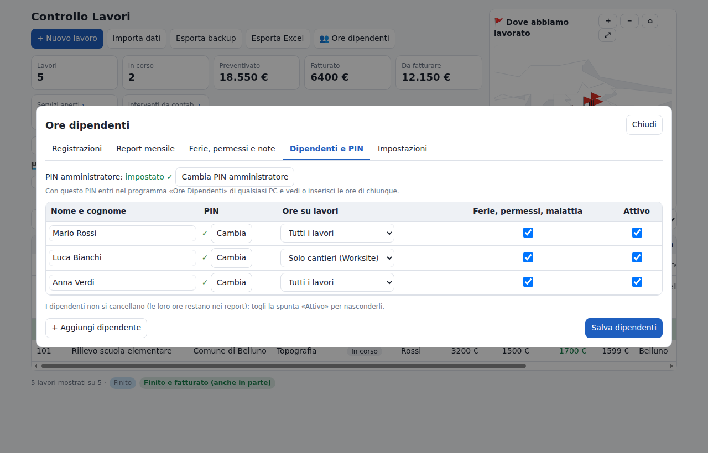<figcaption>Dipendenti e PIN: per ognuno il PIN, cosa può inserire (tutti i lavori o solo cantieri), ferie e permessi, attivo.</figcaption></figure>

<figure>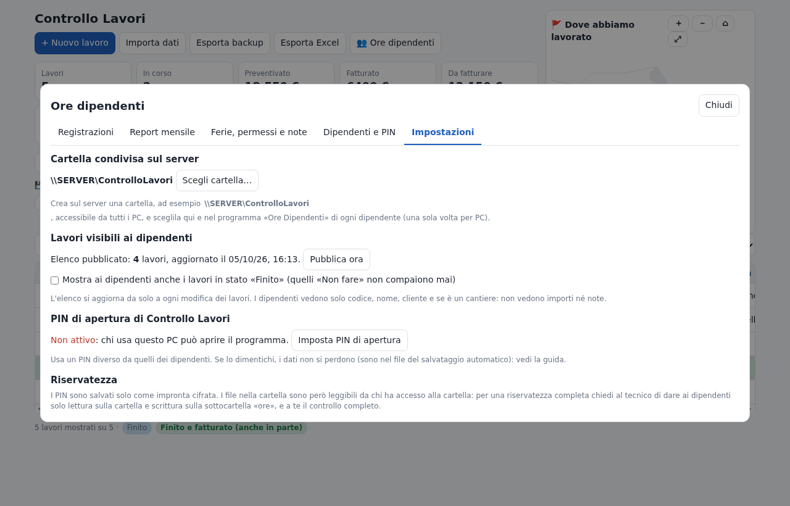<figcaption>Impostazioni: cartella condivisa, lavori visibili ai dipendenti, PIN di apertura.</figcaption></figure>

<div class="pb"></div>

## 5. Installazione: PC dei dipendenti

Circa 5 minuti a PC, con il dipendente presente.

1. Dal PC del dipendente apri `\\SERVER\Programmi` e fai doppio clic su `Ore-Dipendenti-1.7.0-Windows7-32bit-setup.exe` → **Esegui** → **Installa** → **Fine**.
2. Al primo avvio: **Scegli cartella…** → `\\SERVER\ControlloLavori` → **Seleziona cartella**. Una volta sola per PC.
3. Il dipendente sceglie il suo nome e scrive il PIN.
4. **Prova:** inserisce un'ora su un lavoro e salva. Sul PC dell'amministratore, entro un minuto, le ore compaiono nel lavoro in *Ore totali*. Poi cancella la prova con ✕.

**Non installare Controllo Lavori sui PC dei dipendenti.**

<figure><figcaption>Primo accesso: il dipendente sceglie il proprio nome.</figcaption></figure>

<div class="pb"></div>

## 6. Uso di Controllo Lavori (amministratore)

<figure>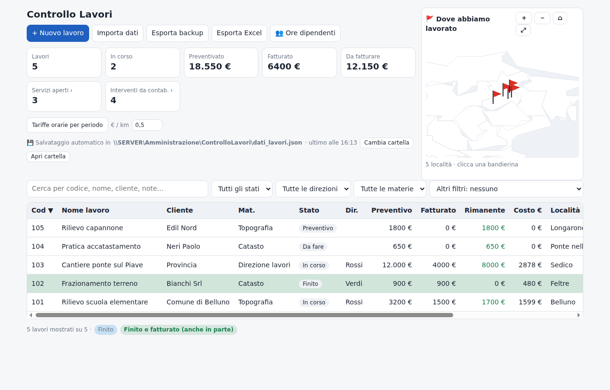<figcaption>La schermata principale.</figcaption></figure>

**Barra in alto**

- **+ Nuovo lavoro**: apre la scheda vuota.
- **Importa dati**: carica un backup `.json` (sostituisce o aggiunge i lavori; si può anche incollare il testo).
- **Esporta backup**: salva un file `.json` con tutti i dati. Fallo ogni tanto e conservalo.
- **Esporta Excel**: elenco dei lavori in formato CSV, che si apre con Excel.
- **👥 Ore dipendenti**: tutto ciò che riguarda i dipendenti (capitolo 7).
- **🔒 Blocca**: chiude subito il programma; per riaprirlo serve il PIN.

**Riquadri**: numero di lavori, in corso, preventivato, fatturato, da fatturare. **Servizi aperti ›** e **Interventi da contab. ›** si cliccano: aprono l'elenco completo.

**Tabella**: un clic su una riga apre la scheda. Clic sull'intestazione di una colonna per ordinare. Le righe azzurre sono lavori *Finiti*, quelle verdi *Finiti e fatturati*. Sopra la tabella: ricerca e filtri per stato, direzione, materia, cantieri, servizi.

**Mappa**: una bandierina per ogni località; clic sulla bandierina per i lavori di quel comune.

**Tariffe orarie per periodo** ed **€/km**: servono a calcolare il costo dei lavori.

<figure>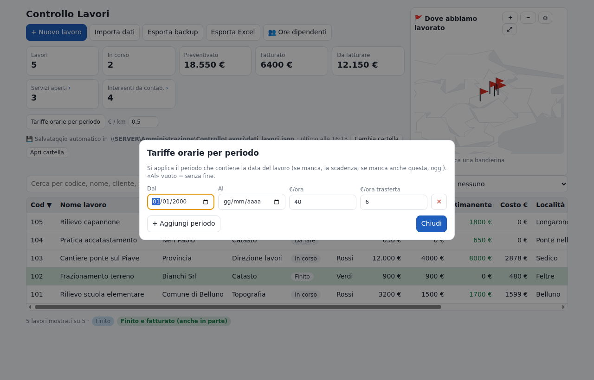<figcaption>Tariffe per periodo: si applica il periodo che contiene la data del lavoro.</figcaption></figure>

**La scheda del lavoro**

<figure>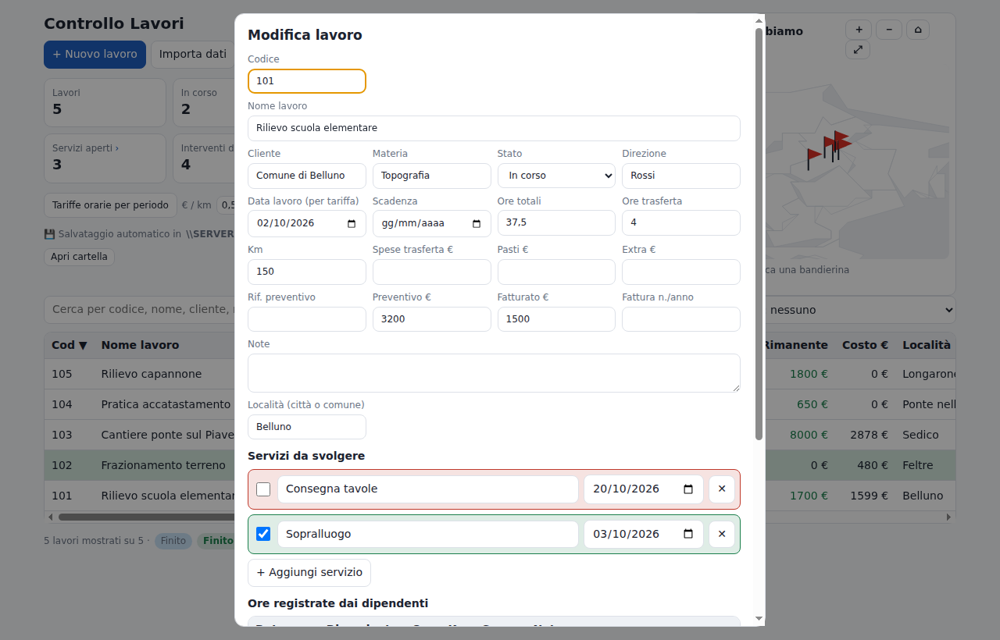<figcaption>Scheda del lavoro: dati, ore, km, spese, preventivo e fatturato.</figcaption></figure>

- **Ore totali** e **Ore trasferta** comprendono già le ore inserite dai dipendenti.
- **Servizi da svolgere**: cose da fare con scadenza; la spunta li chiude (verde), quelli aperti sono rossi.
- **Ore registrate dai dipendenti**: l'elenco di ciò che hanno inserito su questo lavoro.
- In fondo: tariffa applicata, costo ore, km e spese, **costo totale** e **rimanente da fatturare**.

<figure>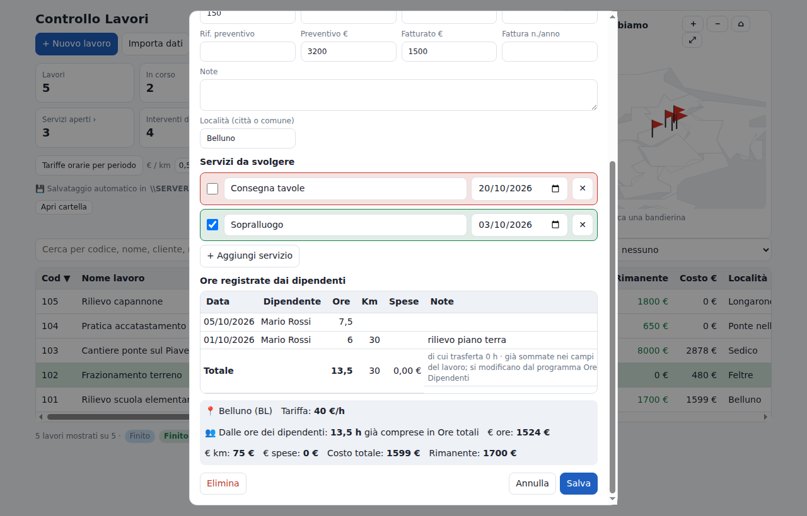<figcaption>Parte bassa della scheda: servizi, ore dei dipendenti e calcolo del costo.</figcaption></figure>

**Cantieri (Worksite)**: nella colonna *Worksite* della tabella spunta i lavori che sono cantieri. Si apre la tabella degli interventi: data, ore, trasferta, km, spese, operatore, note. Quando l'intervento è fatturato spunta **Contab.** e la riga diventa verde. Le righe con 👤 arrivano dai dipendenti e si correggono dal loro programma.

<figure>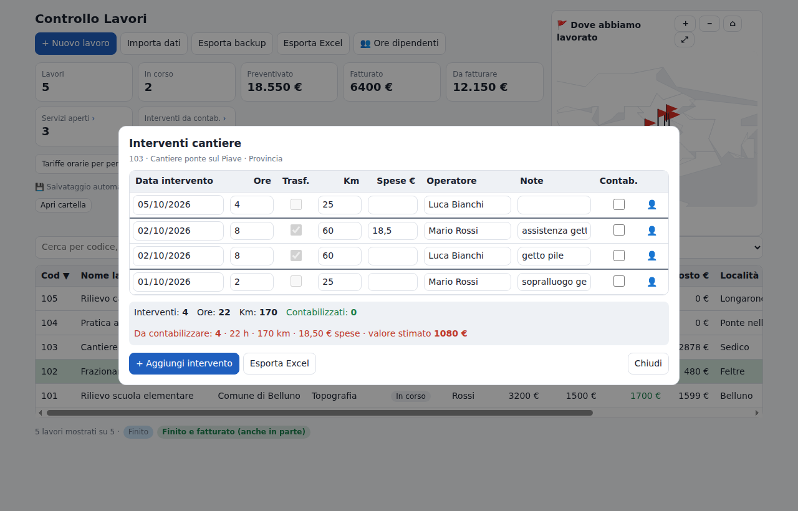<figcaption>Interventi di un cantiere, con i totali da contabilizzare.</figcaption></figure>

<figure>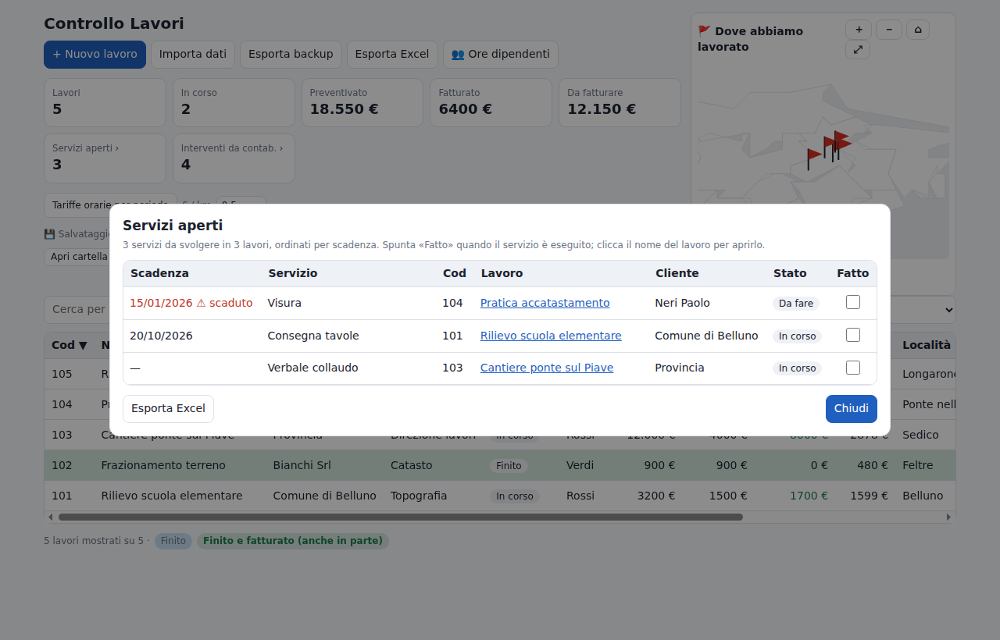<figcaption>Servizi aperti di tutti i lavori, in ordine di scadenza (gli scaduti in rosso).</figcaption></figure>

**Salvataggio**: ogni modifica si salva da sola nel file indicato dalla riga *Salvataggio automatico*, con una copia al giorno nella sottocartella *storico* (ultimi 60 giorni).

**PIN di apertura**: il programma lo chiede a ogni apertura e dopo 20 minuti senza attività.

<figure class="sm" style="max-width:420px;margin-left:auto;margin-right:auto">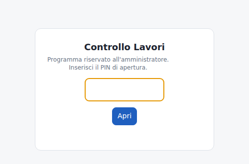<figcaption>Schermata di blocco.</figcaption></figure>

<div class="pb"></div>

## 7. Ore dei dipendenti: cosa vede l'amministratore

Non serve fare nulla perché le ore arrivino: il programma rilegge il server all'apertura, ogni minuto e quando ci si torna sopra. Mentre una scheda è aperta non viene toccata.

<figure>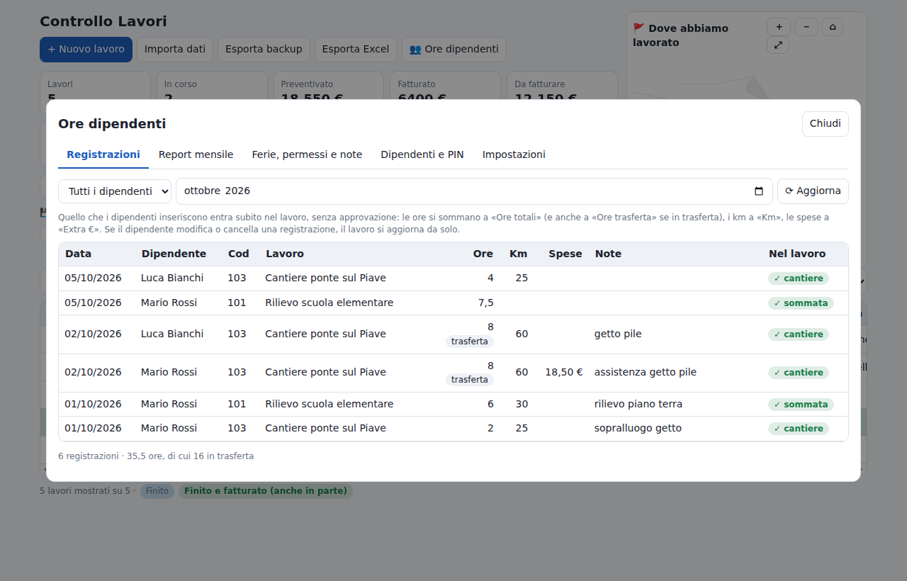<figcaption>Registrazioni: tutto ciò che hanno inserito, con ✓ quando è già sommato nel lavoro.</figcaption></figure>

<figure>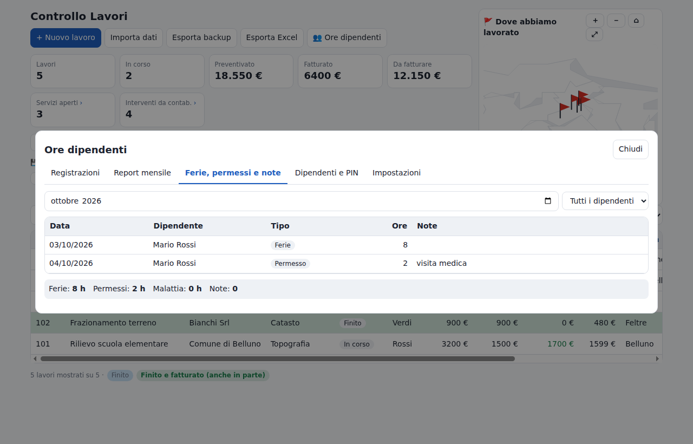<figcaption>Ferie, permessi e note del mese.</figcaption></figure>

**Report mensile per le buste paga**: scegli il mese e il dipendente (o *Tutti i dipendenti*), poi **Stampa** (un foglio A4 a testa, con le firme) o **Esporta Excel** (una riga per registrazione, da dare al consulente).

<figure>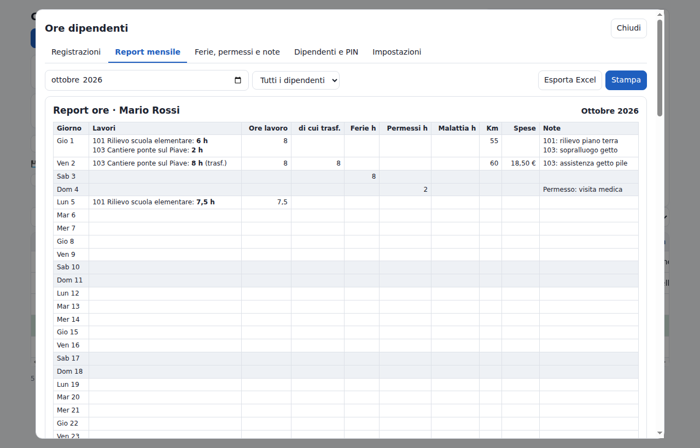<figcaption>Report mensile a schermo.</figcaption></figure>

<figure class="sm">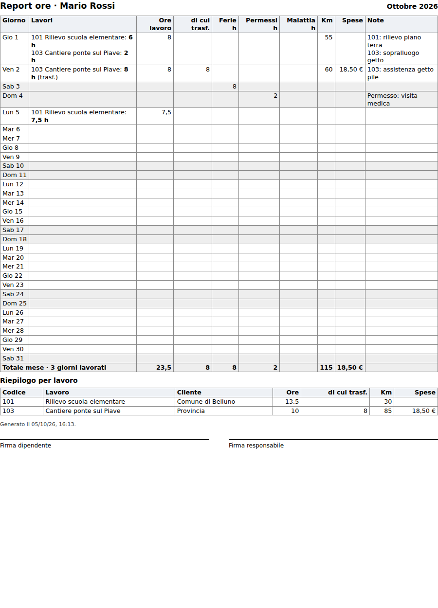<figcaption>Il report stampato: giorno per giorno, totali del mese, riepilogo per lavoro e firme.</figcaption></figure>

<div class="pb"></div>

## 8. Uso di Ore Dipendenti (dipendenti)

*Questa parte si può stampare e lasciare ai dipendenti.*

**Entrare**: apri **Ore Dipendenti** dal menu Start, clicca il tuo nome, scrivi il tuo **PIN** e premi **Entra**. Il PIN è personale.

<figure>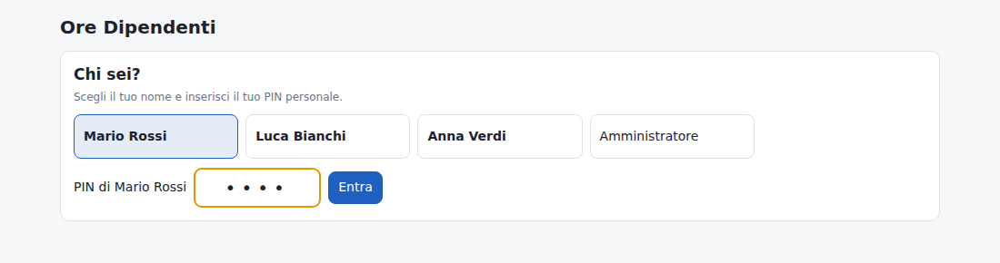<figcaption>Nome e PIN.</figcaption></figure>

**Inserire le ore di un lavoro**

1. **Data**: il giorno lavorato.
2. **Tipo**: *Ore su lavoro*.
3. **Lavoro**: scrivi il codice o il nome e sceglilo dall'elenco.
4. **Ore**: anche con i decimali (es. 7,5).
5. Se quel giorno eri in trasferta, spunta **In trasferta**.
6. **Km** e **Spese €** se ci sono; **Note** facoltative.
7. **Salva**. Più lavori nello stesso giorno: una riga per ciascuno.

**Uscite in cantiere**: i lavori che sono cantieri hanno la scritta *cantiere* nell'elenco; il pulsante diventa **Salva uscita in cantiere**. Si compila allo stesso modo.

<figure>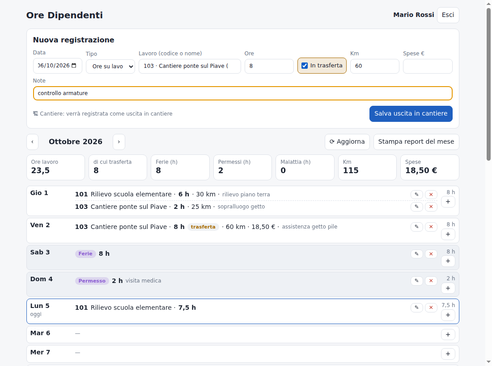<figcaption>Un'uscita in cantiere, in trasferta, con i km; sotto, il mese.</figcaption></figure>

**Ferie e permessi**: in *Tipo* scegli **Ferie**, **Permesso** o **Malattia**, metti la data e le ore (giornata intera: 8) e salva. **Nota del giorno**: per segnalare qualcosa all'ufficio.

**Il tuo mese**: giorno per giorno, con i totali in alto; **‹ ›** per cambiare mese. **✎** per correggere, **✕** per cancellare: la correzione arriva in ufficio da sola. **+** accanto a un giorno per aggiungere in quella data. **Stampa report del mese** per il tuo riepilogo. Alla fine **Esci**.

<figure>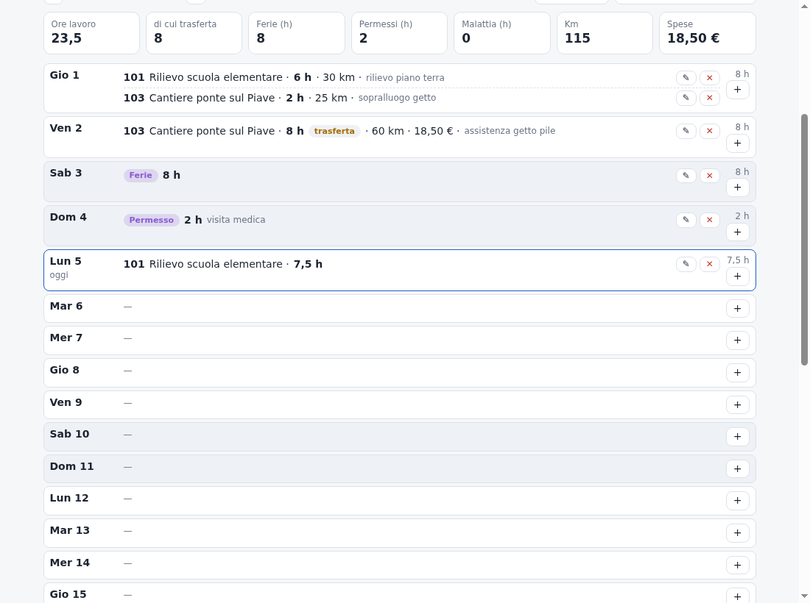<figcaption>Il mese del dipendente con ore, trasferte, ferie e permessi.</figcaption></figure>

Se compare *Server non raggiungibile*, continua pure: le ore restano sul PC e partono quando il server torna.

<div class="pb"></div>

## 9. Situazioni frequenti e problemi

| Situazione | Cosa fare |
| --- | --- |
| Nuovo dipendente | 👥 → Dipendenti e PIN → + Aggiungi dipendente → Imposta PIN → Salva dipendenti; poi installa Ore Dipendenti sul suo PC |
| Dipendente che dimentica il PIN | 👥 → Dipendenti e PIN → Cambia accanto al nome → Salva dipendenti |
| Dipendente che lascia l'azienda | Togli la spunta *Attivo* e salva: le sue ore restano nei report |
| Inserire ore al posto di un dipendente | In Ore Dipendenti scegli *Amministratore*, PIN amministratore, poi il dipendente in alto |
| Nuovo lavoro | Crealo in Controllo Lavori: compare da solo ai dipendenti (non i lavori *Finito* e *Non fare*) |
| ⚠ sul pulsante 👥 | Ore su un lavoro cancellato o con codice cambiato: ripristina il codice o fai correggere la riga |
| Server spento | I dipendenti continuano; le ore partono quando il server torna; nessuna ora viene tolta |
| PC dell'amministratore spento | Le ore entrano nei lavori alla prossima apertura |
| Nuova versione | Esegui il nuovo setup sopra al vecchio: dati e impostazioni restano |
| PIN di apertura dimenticato | Chiudi il programma, cancella `C:\Users\<utente>\AppData\Roaming\Controllo Lavori\Local Storage` e riapri: i lavori si ricaricano dal salvataggio automatico; imposta un nuovo PIN |
| Avviso di Windows all'avvio | Il programma non ha firma digitale: *Esegui* (Windows 10/11: *Ulteriori informazioni* → *Esegui comunque*) |

**Prima di partire con tutti**

- ☐ Una settimana di prova con 1-2 dipendenti
- ☐ **Esporta backup** il primo giorno e conserva il file
- ☐ Verifica che le cartelle del server siano nei backup
